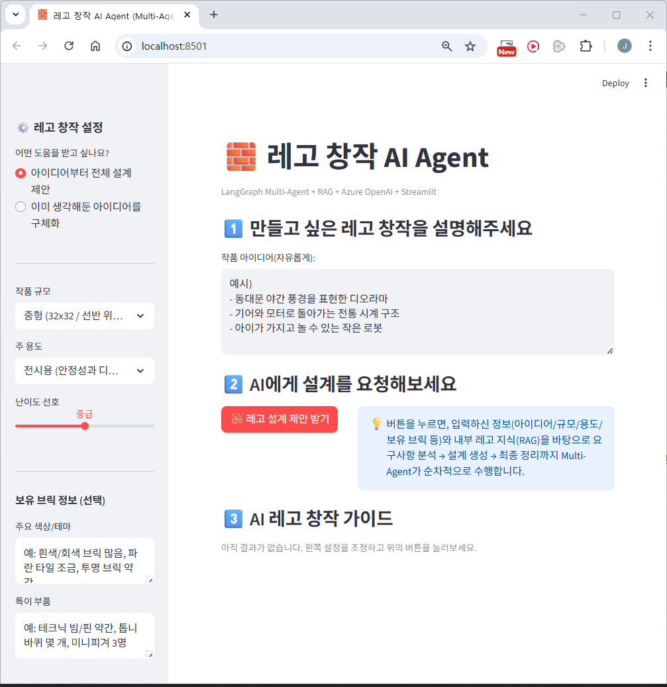
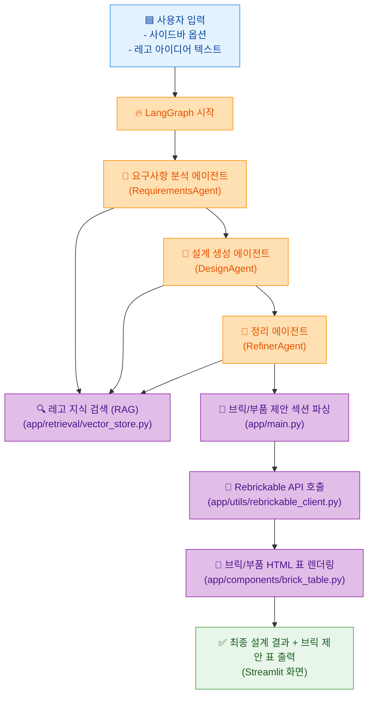
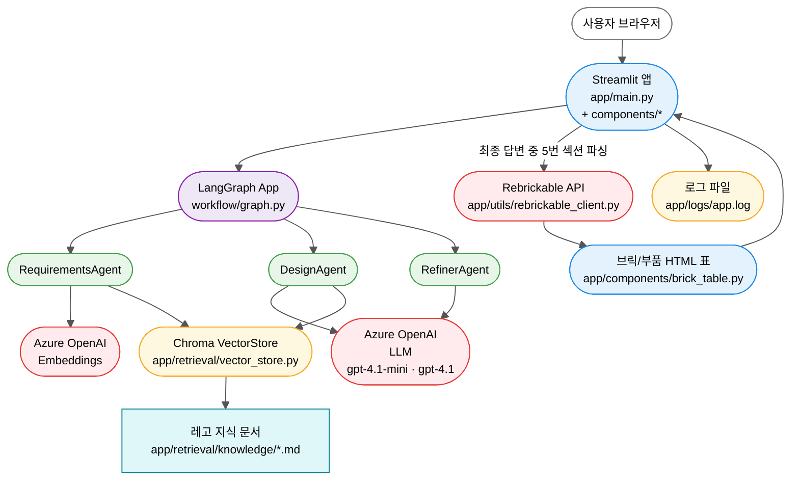
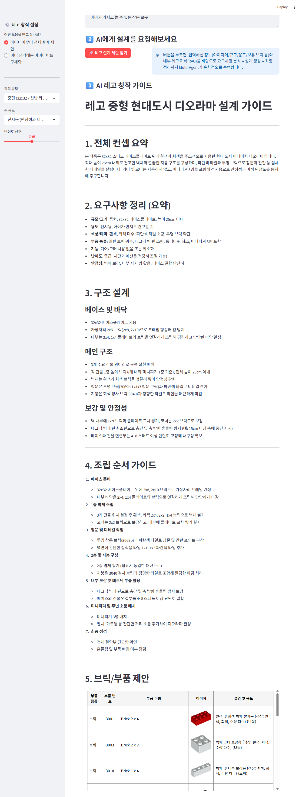
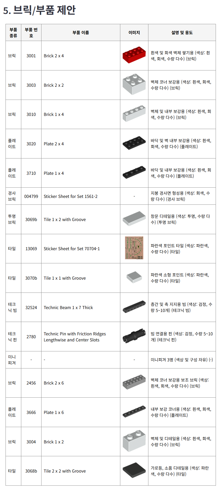

# 레고 창작 AI Agent (Multi-Agent + RAG + Streamlit)



**[그림 1] 레고 창작 Agent의 초기 생성 결과 화면**

레고 창작 설계용 Multi-Agent 기반 에이전트 프로젝트입니다.  
사용자가 만들고 싶은 레고 작품의 컨셉·크기·용도 등을 입력하면, 여러 에이전트가 협업하여 <br/>
**요구사항 분석 → 구조 설계 → 최종 가이드 생성**까지 자동으로 수행합니다.

---

## ⭐ 주요 특징

- **Multi-Agent + LangGraph** 워크플로우
- **RAG 기반 지식 검색** (레고 기초 문서)
- **Rebrickable API**로 브릭/부품 이미지 자동 조회
- **Streamlit** 기반 웹 UI (로컬 브라우저 실행)
- **Azure OpenAI (Foundry)**
  - Chat: `gpt-4.1-mini`, `gpt-4.1`
  - Embedding: `text-embedding-3-*`

---

## 📑 Table of Contents

- [1. 기능 개요](#-1-기능-개요)
- [2. 사용자 흐름 (User Flow)](#-2-사용자-흐름-user-flow)
- [3. 서비스 아키텍처](#-3-서비스-아키텍처)
- [4. 프로젝트 구조(전체 트리)](#-4-프로젝트-구조전체-트리)
- [5. 주요 모듈 설명](#-5-주요-모듈-설명)
- [6. 환경변수 설정 (.env 예시)](#-6-환경변수-설정-env-예시)
- [7. 실행 방법](#-7-실행-방법)
- [8. Azure OpenAI 연결 테스트](#-8-azure-openai-연결-테스트)
- [9. TODO (향후 개선 예정)](#-9-todo-향후-개선-예정)
- [10. 문의](#-10-문의)
- [11. 결과 예시](#-11-결과-예시)

---

## 📌 1. 기능 개요

에이전트들은 아래 단계로 협업합니다.

1. **사용자 입력**
   - 작품명, 용도(전시/놀이), 목표 크기, 난이도, 추가 제약 조건 등
2. **요구사항 분석 (RequirementsAgent)**
   - 입력을 구조화(요구/제약/우선순위 등)
3. **설계 제안 (DesignAgent)**
   - 구조, 모듈 분리, 색상/브릭 종류, 안정성 고려사항 등 제안
4. **RAG 기반 지식 보강**
   - 준비된 레고 지식 문서를 검색해 설계를 보완
5. **최종 결과 정리 (RefinerAgent)**
   - 사람이 읽기 좋은 가이드/체크리스트/빌드 팁 등으로 정리
6. **브릭/부품 제안 표 생성**
   - Refiner 결과 중 “브릭/부품 제안” 섹션을 파싱
   - Rebrickable API로 각 부품의 이름·이미지를 조회 후 HTML 표로 렌더링
7. **Streamlit UI 출력**
   - 최종 텍스트 + 브릭/부품 표를 한 화면에 표시

---

## 📌 2. 사용자 흐름 (User Flow)



- 사용자가 사이드바 + 자유 텍스트로 아이디어를 입력합니다.
- LangGraph가 Requirements → Design → Refiner 에이전트를 순차 실행합니다.
- Refiner 결과 안의 "브릭/부품 제안"”" 섹션을 main.py에서 따로 파싱합니다.
- 각 행의 부품 번호를 기준으로 Rebrickable API 를 호출해 이미지·영문명 등을 채웁니다.
- brick_table.py에서 HTML 테이블을 생성해 Streamlit에서 스크롤 가능한 표로 렌더링합니다.

---

## 📌 3. 서비스 아키텍처



- **프론트엔드**: Streamlit UI + HTML 브릭 표(components/brick_table.py)
- **워크플로우**: LangGraph 기반 Multi-Agent (workflow/graph.py)
- **백엔드**: Azure OpenAI LLM/Embeddings, Chroma VectorStore, Rebrickable API 연동
- **로깅**: 콘솔 + app/logs/app.log 파일 (UTC+9, 순환 로그)

---

## 📌 4. 프로젝트 구조(전체 트리)

```text
lego-ai-service/
├─ app/
│  ├─ main.py                     # Streamlit 엔트리 + 브릭 표 파싱/렌더링
│  ├─ components/
│  │  ├─ sidebar.py               # 사이드바 UI 구성
│  │  └─ brick_table.py           # 브릭/부품 HTML 테이블 생성
│  ├─ workflow/
│  │  ├─ state.py                 # LegoState / AgentRole 정의
│  │  ├─ graph.py                 # LangGraph 워크플로우 정의
│  │  └─ agents/
│  │     ├─ base_agent.py         # 공통 에이전트 베이스 클래스
│  │     ├─ requirements_agent.py # 요구사항 분석 에이전트
│  │     ├─ design_agent.py       # 설계 제안 에이전트
│  │     └─ refiner_agent.py      # 최종 정리/문서화 에이전트
│  ├─ retrieval/
│  │  ├─ vector_store.py          # Chroma 기반 RAG 벡터스토어
│  │  ├─ knowledge/               # 레고 지식 Markdown 문서들 (*.md)
│  │  └─ chroma_db/               # 최초 실행 시 자동 생성되는 벡터 DB
│  └─ utils/
│     ├─ config.py                # Azure OpenAI LLM/Embedding 팩토리
│     └─ rebrickable_client.py    # Rebrickable API 클라이언트
│
├─ images/                        # README용 스크린샷/이미지
├─ mermaid/                       # (선택) 다이어그램 원본 .mmd 파일
│
├─ .env.example                   # 환경변수 템플릿
├─ .gitignore
├─ Dockerfile
├─ docker-compose.yml             # 로컬 개발용 docker-compose 설정
├─ requirements.txt
├─ test_azure_openai.py           # Azure OpenAI 연결 테스트 스크립트
└─ README.md
```

## 📌 5. 주요 모듈 설명

| 모듈 경로                     | 역할 요약                                                  |
| ----------------------------- | ---------------------------------------------------------- |
| `app/main.py`                 | Streamlit 메인 실행, LangGraph 호출, 결과 & 브릭 표 렌더링 |
| `components/sidebar.py`       | 사용자 입력 UI, 입력값을 LegoState로 변환                  |
| `components/brick_table.py`   | 브릭 제안 파싱, Rebrickable API 조회, HTML 표 생성         |
| `utils/rebrickable_client.py` | Rebrickable API 호출(부품 번호/이름/이미지 조회)           |
| `workflow/state.py`           | LangGraph 상태(LegoState) 정의                             |
| `workflow/graph.py`           | Multi-Agent 실행 플로우 구성 (Req → Design → Refiner)      |
| `workflow/agents/*`           | 세부 에이전트 구현 (요구/설계/정리)                        |
| `retrieval/vector_store.py`   | Chroma 기반 RAG 검색 엔진 구성                             |
| `utils/config.py`             | Azure OpenAI 설정 로드, LLM/Embeddings 선택 함수 제공      |

## 📌 6. 환경변수 설정 (.env 예시)

Azure OpenAI를 사용하기 위한 환경변수입니다.  
`.env.example`을 복사하여 `.env` 파일을 만들고, 실제 값으로 수정해 주세요.

```bash
# == Azure Foundry 리소스 ==
AOAI_ENDPOINT=https://{your-resource-name}.openai.azure.com/
AOAI_API_KEY=YOUR_AOAI_KEY
AOAI_API_VERSION=2024-02-01

# == Chat 모델 배포 ==
# 기본 모델 (mini)
AOAI_DEPLOY_GPT4O_MINI=gpt-4.1-mini
# 고성능 모델
AOAI_DEPLOY_GPT4O=gpt-4.1

# == Embedding 모델 배포 ==
AOAI_DEPLOY_EMBED_3_LARGE=text-embedding-3-large
AOAI_DEPLOY_EMBED_3_SMALL=
AOAI_DEPLOY_EMBED_ADA=

# == Rebrickable API ==
REBRICKABLE_API_KEY=YOUR_REBRICKABLE_KEY
REBRICKABLE_API_BASE=https://rebrickable.com/api/v3
```

---

## 📌 7. 실행 방법

사전 요구사항

- Python 3.10+ (권장: 3.11)
- Docker & Docker Compose (선택 사항, Docker 기반 실행 시)
- Azure OpenAI (Foundry) 리소스
- Rebrickable API Key (브릭 이미지/이름 조회 시 활용)

### 1) 로컬(가상환경) 실행

```bash
git clone https://github.com/pcmola/lego-ai-service.git
cd lego-ai-service

python -m venv .venv
# Windows PowerShell
#   .venv\Scripts\Activate.ps1
# macOS / Linux
#   source .venv/bin/activate

pip install -r requirements.txt

cp .env.example .env
# .env 파일을 열어 Azure OpenAI / Rebrickable 설정값 수정

streamlit run app/main.py
```

- Streamlit 앱 실행 후 브라우저에서 아래 주소로 접속합니다.
  - ➡ <http://localhost:8501>
- 첫 실행 시
  - `app/retrieval/chroma_db/` 디렉터리가 생성되며, 지식 문서 임베딩이 저장됩니다.
  - `app/logs/app.log` 에 상세 로그가 남습니다.

### 2) Docker 단일 컨테이너 실행

```bash
docker build -t lego-agent .
docker run -it --rm -p 8501:8501 --env-file .env lego-agent
```

- 코드 변경 시에는 이미지를 다시 빌드해야 반영됩니다.

### 3) Docker Compose 실행 (개발용 hot reload)

`docker-compose.yml`을 이용하면 로컬 코드 변경이 컨테이너에 바로 반영됩니다.

```bash
docker-compose up --build
# 이후부터는 코드만 수정하고
# docker-compose up   # 으로 재시작하면 됨
```

- 주요 설정

  - 포트 매핑: `8501:8501`
  - 볼륨 마운트

    - `./app:/app/app`
    - `./retrieval:/app/retrieval`

  - 커맨드: `streamlit run app/main.py --server.port=8501 --server.address=0.0.0.0`

---

## 📌 8. Azure OpenAI 연결 테스트

이 프로젝트가 Azure OpenAI와 정상적으로 통신하는지 확인하려면  
아래 스크립트를 실행하여 LLM 및 Embedding 모델을 테스트할 수 있습니다.

```bash
python test_azure_openai.py
```

### 테스트 내용

- test_azure_openai.py는 다음 항목을 점검합니다:
  - 기본 LLM 테스트 (gpt-4.1-mini)
  - 간단한 질문을 보내 응답이 정상적으로 반환되는지 확인
- 고성능 LLM 테스트 (gpt-4.1)
  - 모델 배포명이 .env와 일치하는지 검증
- Embedding 모델 테스트 (text-embedding-3-large)
  - 벡터 길이 및 생성 여부 확인

### 정상 출력 예시

- 각 모델에서 한 줄 요약 응답 출력
- Embedding 벡터 크기 출력 (예: 3072)

### 오류가 발생할 경우 확인할 사항

- .env에 설정된 아래 값이 올바른지 확인
  - AOAI_ENDPOINT
  - AOAI_API_KEY
  - AOAI_API_VERSION
  - AOAI_DEPLOY_GPT4O_MINI, AOAI_DEPLOY_GPT4O
  - AOAI_DEPLOY_EMBED_3_LARGE
- 네트워크 또는 방화벽 정책
- Azure OpenAI 리소스 모델 배포명 오타 여부

문제가 지속되면 `app/logs/app.log` 파일에서 상세 오류 원인을 확인할 수 있습니다.

## 📌 9. TODO (향후 개선 예정)

- [ ] 브릭/부품 제안 파싱 정확도 개선
- [ ] Rebrickable API 캐싱 및 대체 파트 처리 강화
- [ ] 브릭 표 기능 고도화 (색상/수량 인식)
- [ ] RAG 지식 문서 확장
- [ ] Streamlit UI 개선 (히스토리, Export 기능)
- [ ] 에이전트/파트 파싱 테스트 코드 보강

## 📌 10. 문의

프로젝트 관련 문의 또는 협업 제안은 아래 연락처를 통해 가능합니다.

- **Author:** 메이커 꾸러기 (Jongyoon Won)
- **GitHub:** https://github.com/pcmola
- **Blog:** http://pcmola.com
- **Email:** pcmola@naver.com

## 📌 11. 결과 예시

### 🔹레고 창작 Agent 결과 화면



**[그림 2] AI가 생성한 최종 레고 설계 결과 화면**



**[그림 3] 리브리커블과 연동하여 레고 부품 정보 표시**
