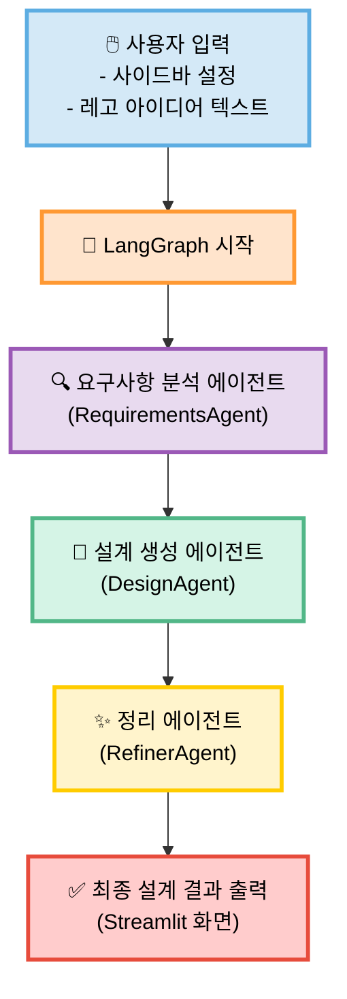
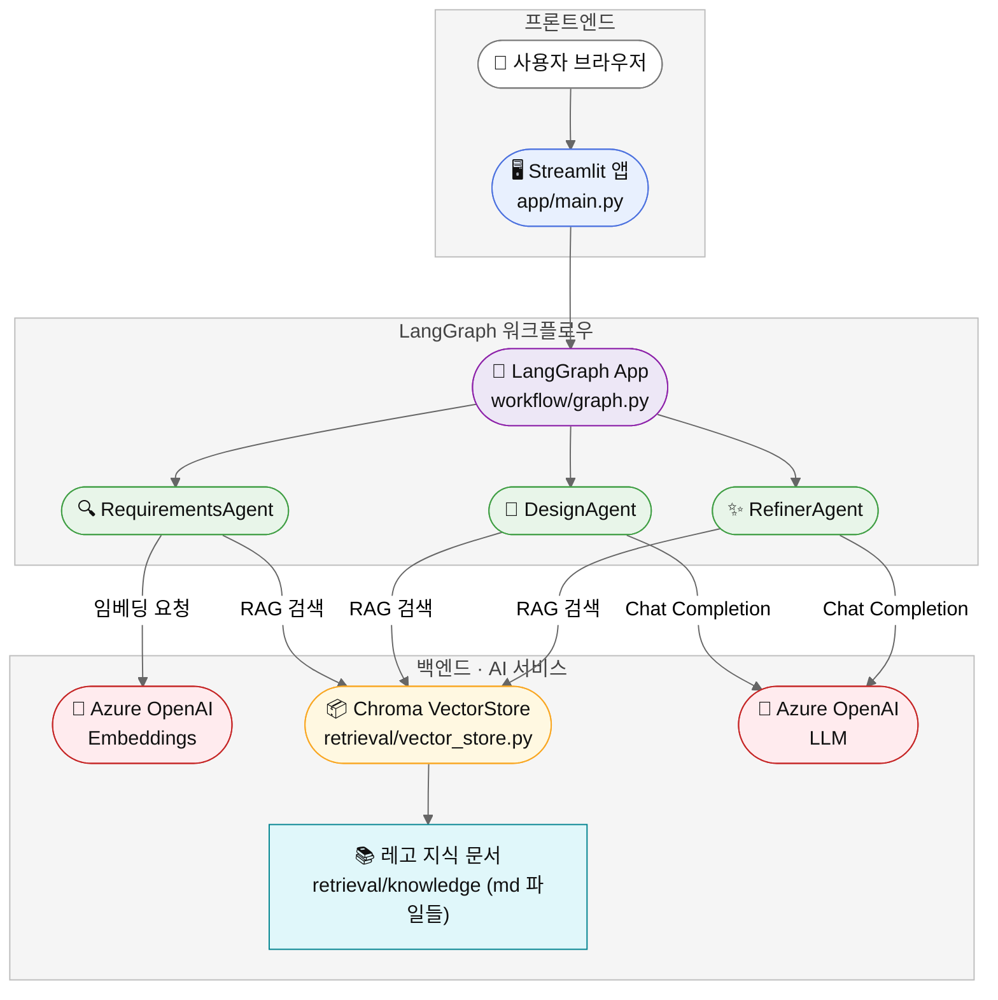

# 레고 창작 AI Agent (Multi-Agent + RAG + Streamlit)


**[그림 1] 레고 창작 Agent의 초기 생성 결과 화면입니다.**

레고 창작 설계용 Multi-Agent 기반 에이전트 프로젝트입니다.  
사용자가 만들고 싶은 레고 작품의 컨셉·크기·용도 등을 입력하면, 여러 에이전트가 협업하여 <br/>
**요구사항 분석 → 구조 설계 → 최종 가이드 생성**까지 자동으로 수행합니다.

---

## ⭐ 주요 특징

- **Multi-Agent + LangGraph** 기반 워크플로우
- **RAG 기반 지식검색**(레고 관련 기초 문서)
- **Streamlit UI**로 간단한 브라우저 실행
- **Azure OpenAI GPT-4o / GPT-4o-mini** 활용

---

## 📌 1. 기능 개요

다음 단계로 구성됩니다:

1. 사용자 입력
2. 요구사항 분석(Requirements Agent)
3. 설계 제안(Design Agent)
4. RAG 기반 지식 강화
5. 최종 결과 정리(Refiner Agent)
6. Streamlit UI 출력

---

## 📌 2. 사용자 흐름 (User Flow)



---

## 📌 3. 서비스 아키텍처



- **Streamlit UI**
- **LangGraph Multi-Agent Orchestrator**
- **Azure OpenAI Chat/Embedding 모델**
- **Chroma Vector DB 기반 RAG**
- **Knowledge Markdown 문서 기반 지식베이스**

---

## 📌 4. 프로젝트 구조(전체 트리)

```text
lego-ai-service/
├─ app/
│  ├─ main.py
│  ├─ components/
│  │  └─ sidebar.py
│  ├─ workflow/
│  │  ├─ state.py
│  │  ├─ graph.py
│  │  └─ agents/
│  │     ├─ base_agent.py
│  │     ├─ requirements_agent.py
│  │     ├─ design_agent.py
│  │     └─ refiner_agent.py
│  ├─ retrieval/
│  │  ├─ vector_store.py
│  │  └─ knowledge/
│  │     └─ ...
│  └─ utils/
│     └─ config.py
│
├─ images/
│
├─ .env.example
├─ .gitignore
├─ Dockerfile
├─ requirements.txt
├─ test_azure_openai.py
└─ README.md
```

## 📌 5. 주요 모듈 설명

### 🔹 `app/main.py`

Streamlit 애플리케이션의 엔트리 포인트입니다.

- 사이드바에서 사용자 입력을 받음
- `LegoState` 초기화
- LangGraph 워크플로우 실행
- 에이전트별 결과를 화면에 출력

---

### 🔹 `app/components/sidebar.py`

Streamlit 사이드바 UI를 구성합니다.

- 작품명, 용도(전시/놀이), 크기, 난이도 등 입력 폼 제공
- 입력된 값을 `LegoState` 로 넘길 수 있는 형태로 정리

---

### 🔹 `app/workflow/state.py`

에이전트 간 공유되는 전체 상태(State)를 관리합니다.

- **`LegoState`**  
  사용자 입력, 중간 결과, 최종 결과까지 모두 저장하는 구조체
- **`AgentRole` Enum**  
  요구사항 분석 / 설계 / 요약 등 에이전트 역할 정의

---

### 🔹 `app/workflow/graph.py`

LangGraph 기반 Multi-Agent 워크플로우를 정의합니다.

- 실행 흐름:
  1. Requirements Agent
  2. Design Agent
  3. (필요 시) RAG 검색
  4. Refiner Agent
- 에이전트 간 데이터 전달 방식 및 오류 제어 로직 포함

---

### 🔹 `app/workflow/agents/base_agent.py`

모든 에이전트의 공통 부모 클래스입니다.

- 공통 LLM 호출 로직
- 프롬프트 템플릿 관리
- 로그 출력 / 예외 처리 등 공통 기능

---

### 🔹 `app/workflow/agents/requirements_agent.py`

요구사항 분석 담당 에이전트입니다.

- 사용자 입력을 요약
- 요구사항/제약조건/우선순위 구조화
- 설계 에이전트에서 활용할 분석 결과 생성

---

### 🔹 `app/workflow/agents/design_agent.py`

설계 제안 담당 에이전트입니다.

- 전체 구조 / 모듈 분리 / 색상 및 브릭 종류 제안
- 안정성 고려사항 / 기믹 구성 요소 분석
- 필요 시 RAG 검색 정보를 반영하여 설계 고도화

---

### 🔹 `app/workflow/agents/refiner_agent.py`

최종 결과 정리 및 문서화 담당 에이전트입니다.

- Requirements + Design 결과를 하나의 문서 형태로 단일화
- 사용자 친화적 요약/체크리스트/가이드라인 생성

---

### 🔹 `app/retrieval/vector_store.py`

RAG(지식검색) 구성 요소입니다.

- Markdown 기반 지식 문서 로드
- 임베딩 생성 후 Chroma Vector Store에 저장
- 검색 질의 시 최적의 문서를 찾아 에이전트에게 컨텍스트 제공

---

### 🔹 `app/utils/config.py`

Azure OpenAI 환경 설정 관리 모듈입니다.

- `.env` 파일 로드
- Chat 모델 및 Embedding 모델 인스턴스 생성
- Streamlit 및 LangGraph에서 사용할 설정값 제공

---

## 📌 6. 환경변수 설정 (.env 예시)

Azure OpenAI를 사용하기 위한 환경변수입니다.  
`.env.example`을 복사하여 `.env` 파일을 만들고, 실제 값으로 수정해 주세요.

```bash
AOAI_ENDPOINT=https://{your-resource-name}.openai.azure.com/
AOAI_API_KEY=YOUR_AOAI_KEY
AOAI_DEPLOY_GPT4O_MINI=gpt-4o-mini
AOAI_DEPLOY_GPT4O=gpt-4o
AOAI_DEPLOY_EMBED_3_LARGE=text-embedding-3-large
AOAI_DEPLOY_EMBED_3_SMALL=text-embedding-3-small
AOAI_DEPLOY_EMBED_ADA=text-embedding-ada-002
AOAI_API_VERSION=2024-02-01
```

---

## 📌 7. 실행 방법

### 🔹 로컬 실행

```bash
git clone https://github.com/pcmola/lego-ai-service.git
cd lego-ai-service

python -m venv .venv
source .venv/bin/activate   # Windows: .venv\Scripts\activate

pip install -r requirements.txt

cp .env.example .env
# .env 파일을 열어 Azure OpenAI 설정값 수정

streamlit run app/main.py
```

Streamlit 앱 실행 후 브라우저에서 아래 주소로 접속합니다.

- ➡ <http://localhost:8501>

### 🔹 Docker 실행

```bash
docker build -t lego-agent .

docker run -it --rm -p 8501:8501 --env-file .env lego-agent
```

---

## 📌 8. Azure OpenAI 연결 테스트

Azure OpenAI 설정이 정상적으로 적용되었는지 확인하려면 아래 명령을 실행하세요.

```bash
python test_azure_openai.py
```

- 정상 동작: 모델의 간단한 응답 또는 테스트 메시지가 출력됩니다.
- 오류 발생 시:
  - .env 파일의 API 키 / 엔드포인트 설정 확인
  - Azure OpenAI 리소스에서 해당 모델이 정상적으로 배포되었는지 확인
  - 네트워크 또는 권한 문제 여부 점검

## 📌 9. TODO (향후 개선 예정)

- [ ] RAG 지식 문서 확장
- [ ] LEGO 브릭(Parts) 리스트 자동 생성 기능
- [ ] 결과물 Markdown / PDF Export 기능
- [ ] 다중 설계안(옵션 A/B/C) 생성 기능
- [ ] 이미지 기반 설계 보조 기능 (예: 사진 입력 → 구조 분석)
- [ ] Streamlit UI 고도화 (단계별 화면, 히스토리 관리 등)

## 📌 10. 문의

프로젝트 관련 문의 또는 협업 제안은 아래 연락처를 통해 가능합니다.

- **Author:** 메이커 꾸러기 (Jongyoon Won)
- **GitHub:** https://github.com/pcmola
- **Blog:** http://pcmola.com
- **Email:** pcmola@naver.com

## 📌 11. 결과 예시

### 🔹레고 창작 Agent 결과 화면


**[그림 4] AI가 생성한 최종 레고 설계 결과 화면입니다.**
